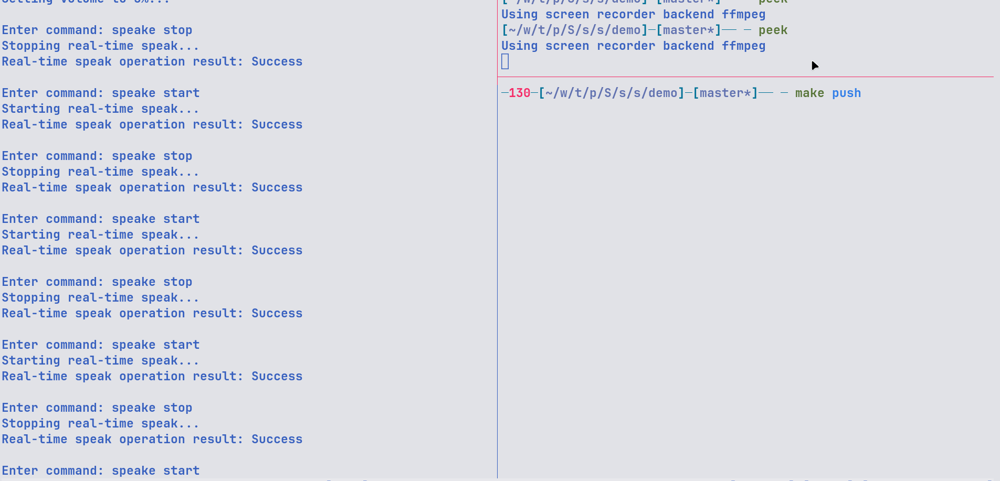
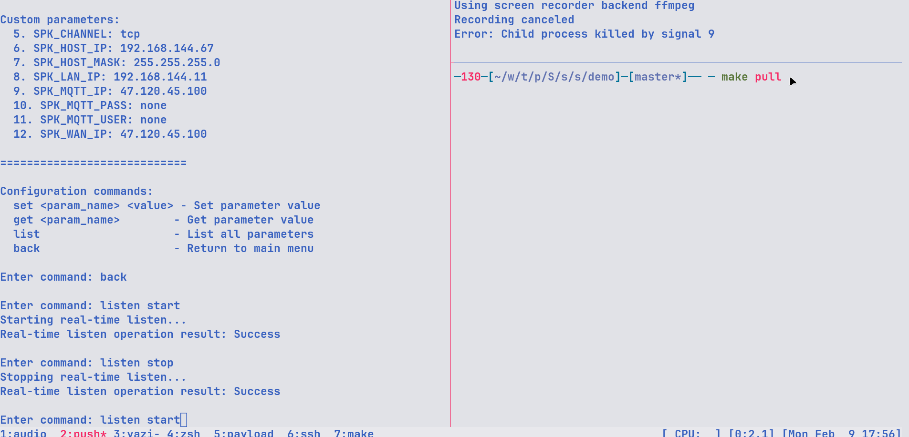

# Description
本仓库为 喊话器(S600L/H600L)的控制SDK，包含了Linux, Windows和Android三个平台的库。
其中，提供了Linux上的demo，因此，Windows和Android上的开发者请参考demo中的代码开发。
# 喊话功能
该喊话器包含实时喊话，录音喊话和文字转语音功能
## 实时喊话
实时喊话需要地面站准备好实时的音频流，再通过喊话器api开启喊话器端拉流操作,操作如下
1. 在根路径下运行`make push`
```bash
ffmpeg -re -i ./audio/audio.wav \
    -vn -acodec aac  \
    -ar 16000 -ac 2 \
    -f rtp -payload_type 97 \
    -sdp_file client_audio.sdp \
    rtp://192.168.144.67:15557

```
2. 在speaker命令行控制中执行`speake start`

## 录音喊话
该功能需要地面站录制音频，然后将音频上传到 `media` 路径下，然后播放
## 文字转语音
该功能也需要地面站完成文字转语音的功能， 然后将音频上传到 `media` 路径下，然后播放
# 实时监听
同样的，实时监听需要先调用api，开启喊话器端的推流，然后地面站拉流
而且实时监听需要通过配置`SPK_LAN_IP`这个参数的值为地面站IP，这样地面站才可以成功拉流
```
ffplay \
    -nodisp \
    -autoexit \
    -protocol_whitelist file,udp,rtp \
	-i ./audio/server_audio.sdp
```

