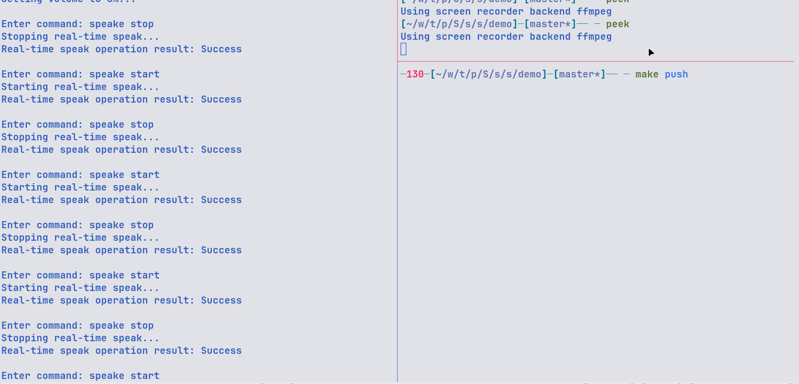
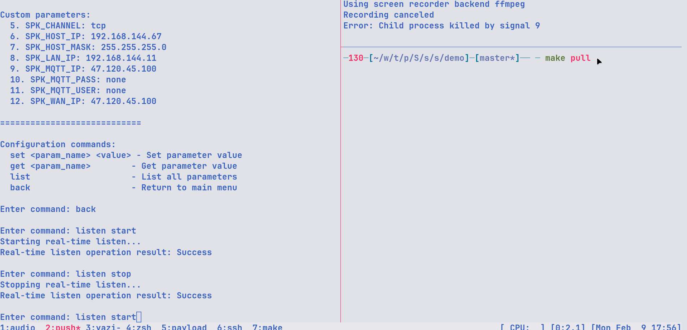

# 准备
+ **请首先查阅喊话器用户手册查看喊话器工作环境和工作电压等参数**
+ **喊话器出厂默认IP为`192.168.144.67`,如自行修改，请在接下来的操作中使用相应的IP**
+ 确保电脑和喊话器在同一局域网下
  + 可通过`ping 192.168.144.67`查看是否在同一局域网
# API 使用
参看 `API_DOC.md`
# 编译和运行
```bash
# 编译
cd demo
make
# 运行
cd demo
./build/S600L_client 192.168.144.67 14556
```

# 喊话功能
该喊话器包含实时喊话，录音喊话和文字转语音功能
## 实时喊话
实时喊话需要地面站准备好实时的音频流，再通过喊话器api开启喊话器端拉流操作,操作如下
1. 在demo下运行`make push`
```bash
ffmpeg -re -i ./audio/audio.wav \
    -vn -acodec aac  \
    -ar 16000 -ac 2 \
    -f rtp -payload_type 97 \
    -sdp_file client_audio.sdp \
    rtp://192.168.144.67:15557

```
2. 在speaker命令行控制中执行`speak start`

## 录音喊话
该功能需要地面站录制音频，然后将音频通过api上传到，然后播放
## 文字转语音
该功能也需要地面站完成文字转语音的功能， 然后将音频上传到喊话器中，然后播放
# 实时监听
同样的，实时监听需要先调用api，开启喊话器端的推流，然后地面站拉流
而且实时监听需要通过配置`SPK_LAN_IP`这个参数的值为地面站IP，例如在demo中通过`config set SPK_LAN_IP 192.168.144.12`，这样地面站才可以成功拉流
```bash
ffplay \
    -nodisp \
    -autoexit \
    -protocol_whitelist file,udp,rtp \
	-i ./audio/server_audio.sdp
```


# 前后双摄
相机出厂默认IP为`192.168.144.19`
拉流地址为 `rtsp://192.168.144.19/554`

在demo下运行`make camera`即可拉流